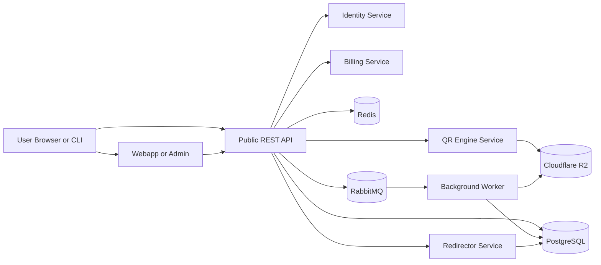

# HaveQR System Architecture

> Architecture and product-technical direction for HaveQR, the QR generation platform built in this `haveqr` repository.

**App Version**: 0.2.5.0  
**Date**: 2026-04-09  
**Repository**: `haveqr`

## Contents

- [HaveQR System Architecture](#haveqr-system-architecture)
  - [Contents](#contents)
  - [1. Executive Summary](#1-executive-summary)
  - [2. Product Scope](#2-product-scope)
    - [Core capabilities](#core-capabilities)
    - [Platform capabilities](#platform-capabilities)
    - [Brand and launch context](#brand-and-launch-context)
  - [3. Architecture Principles](#3-architecture-principles)
  - [4. Key Decisions](#4-key-decisions)
  - [5. High-Level Topology](#5-high-level-topology)
  - [6. Rendering Strategy](#6-rendering-strategy)
    - [Decision](#decision)
    - [Why not browser-side generation as the source of truth?](#why-not-browser-side-generation-as-the-source-of-truth)
    - [Recommended model](#recommended-model)
  - [7. Monorepo Structure](#7-monorepo-structure)
    - [Notes](#notes)
  - [8. Frontend Architecture](#8-frontend-architecture)
    - [`webapp`](#webapp)
    - [`admin`](#admin)
    - [`docs`](#docs)
    - [UI/visual direction](#uivisual-direction)
    - [Public UX policy](#public-ux-policy)
  - [9. Backend Services](#9-backend-services)
    - [9.1 HaveQR.PublicApi](#91-haveqrpublicapi)
    - [9.2 HaveQR.QrEngine](#92-haveqrqrengine)
    - [9.3 HaveQR.Identity](#93-haveqridentity)
    - [9.4 HaveQR.Redirector](#94-haveqrredirector)
    - [9.5 HaveQR.Billing](#95-haveqrbilling)
    - [9.6 HaveQR.Worker](#96-haveqrworker)
    - [9.7 HaveQR.Cli](#97-haveqrcli)
  - [10. QR Generation Pipeline](#10-qr-generation-pipeline)
    - [10.1 Request model](#101-request-model)
    - [10.2 Render pipeline steps](#102-render-pipeline-steps)
    - [10.3 Finder marker shape strategy](#103-finder-marker-shape-strategy)
    - [10.4 Output quality strategy](#104-output-quality-strategy)
  - [11. Data Architecture](#11-data-architecture)
    - [11.1 Storage components](#111-storage-components)
    - [11.2 Persistence modes](#112-persistence-modes)
    - [11.3 Important storage clarification](#113-important-storage-clarification)
      - [What a hash is good for](#what-a-hash-is-good-for)
      - [What a hash cannot do](#what-a-hash-cannot-do)
    - [11.4 Suggested PostgreSQL schemas](#114-suggested-postgresql-schemas)
      - [`auth`](#auth)
      - [`qr`](#qr)
      - [`analytics`](#analytics)
      - [`billing`](#billing)
    - [11.5 Suggested R2 object strategy](#115-suggested-r2-object-strategy)
  - [12. Messaging and Batch Processing](#12-messaging-and-batch-processing)
    - [Decision: RabbitMQ over ActiveMQ](#decision-rabbitmq-over-activemq)
    - [Important limitation](#important-limitation)
    - [Suggested exchanges and events](#suggested-exchanges-and-events)
    - [Batch strategy](#batch-strategy)
  - [13. Authentication and Authorization](#13-authentication-and-authorization)
    - [Public webapp policy](#public-webapp-policy)
    - [Auth capabilities to build now](#auth-capabilities-to-build-now)
    - [Token model](#token-model)
    - [Roles](#roles)
  - [14. Payments and Subscription Collections](#14-payments-and-subscription-collections)
    - [Billing features](#billing-features)
    - [Entitlements likely to be plan-gated](#entitlements-likely-to-be-plan-gated)
    - [Provider strategy](#provider-strategy)
  - [15. Dashboard Functionality](#15-dashboard-functionality)
    - [Customer dashboard](#customer-dashboard)
    - [Admin dashboard](#admin-dashboard)
    - [Marketing counter requirement](#marketing-counter-requirement)
  - [16. Security Architecture](#16-security-architecture)
    - [Input security](#input-security)
    - [Abuse controls](#abuse-controls)
    - [Data security](#data-security)
    - [Application security](#application-security)
  - [17. Deployment Architecture](#17-deployment-architecture)
    - [Current deployment mode](#current-deployment-mode)
    - [Docker Compose services](#docker-compose-services)
    - [Production evolution path](#production-evolution-path)
  - [18. Non-Functional Targets](#18-non-functional-targets)
  - [19. Delivery Phases](#19-delivery-phases)
    - [Phase 1 - Core generator MVP](#phase-1---core-generator-mvp)
    - [Phase 2 - Managed QR and analytics](#phase-2---managed-qr-and-analytics)
    - [Phase 3 - Accounts and subscriptions](#phase-3---accounts-and-subscriptions)
  - [20. Final Recommendation](#20-final-recommendation)

---

## 1. Executive Summary

HaveQR is an anonymous-first QR generation platform that lets users create high-quality QR codes across link-backed categories such as links, app routes, social destinations, PDFs, images, videos, and campaign landing pages, optionally brand them with SVG logos, export print-ready SVG and PNG files, and later manage saved and trackable QR assets through authenticated dashboards. WhatsApp remains the first explicit native builder exception, because generating a `wa.me` route from phone and message data is materially useful in the product flow.

The system will be built as a monorepo with these top-level areas:

- `webapp` - public landing page, QR builder, and future customer dashboard
- `admin` - internal operations console
- `docs` - product, API, and developer documentation
- `microservices` - ASP.NET Core services, workers, shared contracts, and the CLI

The backend will use ASP.NET Core and QRCoder as the QR engine, but the implementation will be **SVG-first**, not bitmap-first. That matters because:

1. SVG logos are a core requirement.
2. Linux containers are the deployment target.
3. Finder marker shape customization is easier and safer at the SVG composition layer.
4. Print-quality PNG output is best generated by rasterizing a canonical SVG render.

The frontend will use **Next.js + React + TypeScript**, not Nuxt, because that aligns with the stated preference, matches the existing AfriFlex reference stack more closely, and keeps the team on one frontend model.

The public web experience will be anonymous by default. Authentication, Google OAuth2, billing, and dashboard APIs will still exist from day one so the product can expose them later without re-architecting the backend.

---

## 2. Product Scope

### Core capabilities

- Generate QR codes across multiple semantic categories, with most v1 inputs captured as normalized destination URLs, including:
  - links and landing pages
  - app links and deep links
  - social profiles or social landing pages
  - PDF, image, and video destinations
  - campaign and document destinations
  - WhatsApp through either a direct target URL or generated `wa.me` route
- Accept SVG logos with transparent or white backgrounds.
- Embed the logo in the center of the QR code.
- Export high-resolution PNG files suitable for web and print.
- Support configurable QR size, error correction level, and logo size.
- Support batch generation from CSV or JSON payloads.
- Expose a REST API for the frontend and automation.
- Provide a CLI for local workflows and CI automation.
- Keep a roadmap path for additional 2D barcode formats beyond QR once a second encoding engine is introduced.
- Provide marker style options for the finder patterns:
  - perfect square
  - slightly rounded
  - perfect circular

### Platform capabilities

- Public anonymous QR creation with rate limiting.
- Optional persistence when a user explicitly saves or upgrades a QR code.
- Dynamic QR redirects and scan tracking for managed QR codes.
- User signup/signin, refresh tokens, and Google OAuth2.
- Subscription billing and plan entitlements.
- Customer dashboard functionality.
- Internal admin dashboard for moderation, support, and analytics.

### Brand and launch context

- Product name: `haveQR`
- Temporary public host: `haveqr.computemore.com`
- Future primary domain: `haveqr.io`
- UX inspiration: `qr.io`
- Visual styling direction: `AfriFlex`

`qr.io` should influence information architecture and conversion flow, not be copied directly. AfriFlex should influence visual language, tone, and motion system.

---

## 3. Architecture Principles

1. **SVG first, PNG second**  
   The canonical render artifact is SVG. PNGs are derived outputs.

2. **Anonymous first, accounts later**  
   The public builder must work without login, but the backend must already support users, plans, and dashboards.

3. **Store only what is needed**  
   Anonymous one-off renders should not create permanent records unless explicitly saved or converted into managed dynamic QR codes.

4. **Hashes are for indexing, not recovery**  
   A hash is useful for dedupe and analytics, but it cannot replace recoverable storage when redirects or dashboards need the original destination.

5. **Linux container compatibility matters more than convenience APIs**  
   Avoid an architecture that depends on Windows-only `System.Drawing` behavior inside Docker.

6. **Use microservices where boundaries are real, not ceremonial**  
   The repository is organized under `microservices`, but early implementation should still avoid unnecessary network hops and service sprawl.

---

## 4. Key Decisions

| Area | Decision | Reason |
| ------ | ---------- | -------- |
| Frontend framework | Next.js + React + TypeScript | Matches stated preference, fits AfriFlex reference stack, excellent SSR/ISR, strong ecosystem |
| QR engine | QRCoder `SvgQRCode` with custom SVG composition layer | Supports SVG logo embedding and Linux-safe rendering path |
| Content model | URL-backed category contract plus lightweight WhatsApp builder | Keeps the initial UI and API simple while preserving the semantic grouping users expect |
| Final output pipeline | Generate SVG first, rasterize to PNG with SkiaSharp/SVG rasterizer | Higher quality output and cross-platform safety |
| Finder marker styles | Custom SVG finder-pattern renderer on top of QRCoder matrix | QRCoder does not natively expose the exact finder shape selector required |
| Public rendering strategy | Hybrid: client-side editor, server-side authoritative QR generation | Keeps UI fast while ensuring consistent output and persistence rules |
| Message bus | RabbitMQ over ActiveMQ | Better fit for .NET teams, easier Docker Compose operations, better docs and tooling |
| Data store | PostgreSQL + Redis + Cloudflare R2 | Strong relational core, fast cache/rate limit layer, cheap asset storage |
| Auth model | JWT access tokens + refresh tokens + Google OAuth2 | Supports future dashboards and subscriptions without forcing launch login |
| Deployment | Docker Compose behind a public tunnel/reverse proxy | Fits current staging reality at `haveqr.computemore.com` |
| URL persistence | Static one-off QR can remain non-persistent; dynamic tracked QR must store encrypted destination | A hash alone cannot power redirect and scan analytics |

---

## 5. High-Level Topology



---

## 6. Rendering Strategy

### Decision

The product should use **server-side QR generation** for the final output and **client-side rendering only for the editor experience**.

### Why not browser-side generation as the source of truth?

Browser-only generation would make the editor feel fast, but it is the wrong authority for this product because:

- QRCoder and the custom finder-pattern compositor live in .NET.
- SVG sanitization is safer on the server.
- Storage to R2 and metadata writes to PostgreSQL belong on the server.
- Batch generation is better handled by workers.
- Anonymous abuse controls are easier to enforce server-side.
- Output consistency matters for print-quality exports.

### Recommended model

- **Marketing pages**: SSR/ISR in Next.js for SEO and fast first paint.
- **Interactive QR builder**: client-side React for instant form updates and preview state.
- **Authoritative render**: server-side REST call to the QR API.
- **Optional preview optimization**: lightweight browser preview using local SVG placeholders, but never treated as the persisted output.

This gives the speed of a modern SPA where it matters and the correctness of server-side rendering where the business value lives.

---

## 7. Monorepo Structure

```text
haveqr/
├── webapp/                # Next.js public site and future customer dashboard
├── admin/                 # Next.js internal admin console
├── docs/                  # Docs site, architecture docs, API reference, guides
├── microservices/
│   ├── HaveQR.PublicApi/  # Public REST facade and orchestration layer
│   ├── HaveQR.QrEngine/   # QRCoder integration and SVG composition
│   ├── HaveQR.Identity/   # Auth, JWT, refresh tokens, Google OAuth2
│   ├── HaveQR.Redirector/ # Dynamic QR redirect + scan tracking
│   ├── HaveQR.Billing/    # Plans, checkout, subscriptions, invoices
│   ├── HaveQR.Worker/     # Batch jobs, storage, analytics rollups, email outbox
│   ├── HaveQR.Contracts/  # Shared DTOs and event contracts
│   └── HaveQR.Cli/        # .NET CLI for local and CI workflows
├── inspiration/           # Saved reference material only, not shippable assets
├── docker-compose.yml
├── HaveQR.sln
└── SYSTEM_ARCHITECTURE.md
```

### Notes

- The top-level structure remains exactly `webapp`, `admin`, `docs`, and `microservices`.
- The CLI lives under `microservices` to avoid adding another top-level area.
- If shared UI packages become necessary later, they can be introduced after the MVP. They are not required to start.

---

## 8. Frontend Architecture

### `webapp`

Purpose:

- Public landing page
- QR builder
- Pricing page
- Feature pages
- Future customer dashboard

Technology:

- Next.js App Router
- React
- TypeScript
- Tailwind CSS or a thin design-token layer on top of CSS variables
- REST integration with the public API

### `admin`

Purpose:

- User management
- Subscription support tooling
- Scan analytics summaries
- Abuse/rate-limit review
- Content and pricing management
- Render/job monitoring

Technology:

- Next.js App Router
- React
- TypeScript
- Protected routes backed by the Identity service

### `docs`

Purpose:

- Product documentation
- API reference generated from OpenAPI
- CLI examples
- Operational runbooks
- Architecture and roadmap notes

Technology:

- Next.js static docs site or Nextra-style MDX site
- OpenAPI sync from `HaveQR.PublicApi`

### UI/visual direction

Use `qr.io` for **what** appears on the page and how quickly the visitor gets to QR creation.

Use AfriFlex for **how** the site feels:

- glass or translucent navigation
- large rounded cards
- cobalt/navy-driven accent system
- bold display typography
- mono numerics for counters and QR sizes
- soft blur or gradient background atmospherics
- direct CTAs with strong visual hierarchy

Do not copy `qr.io` markup, assets, copy, or layout verbatim.

### Public UX policy

- No visible sign-in dependency for first-time QR creation.
- Signup/signin routes exist in the backend from day one.
- Customer dashboard routes can remain feature-flagged until subscriptions are ready.

---

## 9. Backend Services

### 9.1 HaveQR.PublicApi

Responsibilities:

- REST surface consumed by the webapp, admin, and CLI
- request validation and normalization by content type
- orchestration across QR, identity, billing, and redirect domains
- rate-limiting hooks
- OpenAPI generation

Representative endpoints:

- `POST /api/v1/qr/render`
- `POST /api/v1/qr/batch`
- `POST /api/v1/qr/save`
- `GET /api/v1/qr/{id}`
- `POST /api/v1/auth/signup`
- `POST /api/v1/auth/signin`
- `POST /api/v1/auth/refresh`
- `GET /api/v1/auth/google/start`
- `GET /api/v1/auth/google/callback`
- `POST /api/v1/billing/checkout`
- `GET /api/v1/dashboard/summary`

### 9.2 HaveQR.QrEngine

Responsibilities:

- URL normalization and validation
- target URL normalization for most QR categories plus a lightweight WhatsApp builder
- SVG logo sanitization
- QR matrix generation using QRCoder
- finder pattern shape composition
- logo placement rules
- SVG output generation
- PNG rasterization orchestration

Important implementation rule:

Use `QRCoder.SvgQRCode` as the primary render path. Avoid relying on bitmap renderers that are tightly coupled to `System.Drawing` in Linux containers.

### 9.3 HaveQR.Identity

Responsibilities:

- signup/signin
- refresh token rotation
- password reset and email verification
- Google OAuth2 login/signup
- role and claim issuance
- future API key support for automation users

### 9.4 HaveQR.Redirector

Responsibilities:

- serve dynamic short routes such as `/r/{slug}`
- resolve stored destination URLs or hosted asset routes
- log scan events
- increment aggregate counters
- return fast HTTP redirects

This service exists because scan analytics and asset-backed content flows require a resolvable redirect target. A pure hash-only model cannot support that.

### 9.5 HaveQR.Billing

Responsibilities:

- plan catalog
- subscription lifecycle
- checkout session initiation
- payment webhook handling
- entitlement projection for feature limits

### 9.6 HaveQR.Worker

Responsibilities:

- async batch processing
- multi-size PNG generation
- R2 uploads
- email outbox processing
- analytics rollups
- orphan cleanup for abandoned transient assets

### 9.7 HaveQR.Cli

Responsibilities:

- local render calls
- batch upload automation
- CI-friendly export flows
- developer smoke tests against local Docker Compose

Example commands:

```bash
haveqr render \
  --url "https://computemore.com" \
  --logo "./logo.svg" \
  --out "./out/qr.png" \
  --size 1024 \
  --ecc H \
  --finder-border rounded \
  --finder-center circle

haveqr batch \
  --input "./batch.csv" \
  --output-dir "./dist"
```

---

## 10. QR Generation Pipeline

### 10.1 Request model

The core render contract should look conceptually like this:

```json
{
  "contentType": "link",
  "targetUrl": "https://computemore.com",
  "payload": {},
  "mode": "static",
  "output": {
    "sizePx": 1024
  },
  "errorCorrectionLevel": "H",
  "logo": {
    "svg": "<svg ...>",
    "sizePercent": 18
  },
  "finder": {
    "borderShape": "rounded",
    "centerShape": "circle"
  },
  "colors": {
    "dark": "#0B1F3A",
    "light": "#FFFFFF"
  }
}
```

Representative `contentType` values in v1 include `link`, `app`, `social`, `pdf`, `image`, `video`, and `whatsapp`. The category selector remains broader than the underlying payload model: most categories still resolve to a normalized URL in the first implementation slice.

Additional 2D barcode symbologies remain a future extension and are not part of the initial QRCoder-based request contract.

### 10.2 Render pipeline steps

- Validate `contentType`.
- Validate the target URL for the selected content type.
- If the content type is `whatsapp`, either accept a direct target URL or build a `wa.me` destination from the payload fields.
- Enforce `http` or `https` on normalized destinations where applicable.
- Sanitize incoming SVG:

  - remove scripts
  - remove external references
  - reject `foreignObject`
  - normalize viewBox and dimensions

- Normalize the request into canonical JSON.
- Compute hashes:

  - `config_hash = SHA-256(canonical request)`
  - `payload_hash = SHA-256(canonical encoded payload)`
  - `destination_hash = SHA-256(normalized destination URL)` when a redirectable destination exists

- Generate the QR matrix with QRCoder using the selected ECC level and canonical payload string.
- Render a base SVG from QRCoder.
- Replace or overlay the three finder patterns using the requested marker style.
- Current implementation detail: overlay a dedicated finder compositor over the three 7x7 finder windows after base SVG generation so the rest of the matrix stays untouched.
- Clear a safe center area and embed the sanitized SVG logo.
- Rasterize the final SVG to one or more PNG sizes.
- Return the PNG immediately for transient requests, or persist metadata/assets if the request is saved or managed.

### 10.3 Finder marker shape strategy

QRCoder does not directly expose the exact finder-marker selector described in the product requirement. Therefore HaveQR needs a small custom rendering layer that operates on the QR matrix or SVG output.

Supported shapes in v1:

- `square`
- `rounded`
- `circle`

Applied separately to:

- finder border shape
- finder center shape

Recommended v1 scannability rule:

- keep normal data modules square
- customize only the finder patterns
- cap logo size aggressively when ECC is lower than `H`

This is the safest path to maintain scan reliability while still giving users visible customization.

Current implementation note:

- the compositor now writes a dedicated SVG overlay group after QRCoder emits the base SVG
- each finder area is cleared back to the light color and redrawn with the requested border and center shapes
- filesystem storage remains the default runtime, but the storage seam now supports PostgreSQL job-state persistence and R2 artifact persistence through provider selection

### 10.4 Output quality strategy

- Canonical artifact: SVG
- Download format: PNG
- Suggested export sizes: 512, 1024, 2048, and 4096 px
- Default ECC for logo-bearing codes: `H`
- Recommended logo coverage target: 15% to 20%
- Hard validation guardrail: reject or warn above 25% logo coverage

---

## 11. Data Architecture

### 11.1 Storage components

- **PostgreSQL**: metadata, auth, subscriptions, analytics summaries
- **Redis**: rate limiting, short-lived preview cache, session or nonce storage
- **Cloudflare R2**: generated image assets and optional canonical SVG artifacts

### 11.2 Persistence modes

| Mode | Payload or destination storage | Asset storage | Analytics | Use case |
| ------ | ------------- | --------------- | ----------- | ---------- |
| Anonymous transient static QR | No permanent raw payload storage | Optional short-lived cache only | Aggregate generation counter only | Fast one-off generation |
| Saved static QR | Optional, only if user explicitly saves | Yes, PNG and optionally SVG | Download and save counts | User wants to keep/export later |
| Managed dynamic or asset-backed QR | Yes, encrypted destination or hosted asset reference required | Yes | Full scan analytics and redirect metrics | Dashboard, editing, campaigns |

### 11.3 Important storage clarification

The idea of storing only a hashed dictionary is partially valid, but only for some scenarios.

QR content types fall into two technical buckets:

- direct encoded payloads such as text, `mailto`, `tel`, `sms`, Wi-Fi, vCard, and event data
- managed destination types such as link, app, social, PDF, image, and video flows, where the QR resolves to a hosted URL or redirectable landing page

#### What a hash is good for

- deduplication
- cache keys
- anonymized counters
- quick lookups without exposing raw payload text

#### What a hash cannot do

- reconstruct a destination URL or recoverable payload
- power a redirect service
- let a user edit a saved dynamic QR or asset-backed QR

Therefore the correct model is:

- store `config_hash` for all persisted records
- store `payload_hash` for analytics and dedupe
- store encrypted canonical payload for saved direct-payload QR records when recovery or editing is required
- store **encrypted** destination URL or hosted asset reference for managed QR records that must redirect or serve content

That gives privacy without breaking the product.

### 11.4 Suggested PostgreSQL schemas

#### `auth`

- `users`
- `oauth_identities`
- `refresh_tokens`
- `roles`

#### `qr`

- `render_requests`
- `qr_assets`
- `dynamic_routes`
- `qr_tags`

#### `analytics`

- `scan_events`
- `generation_events`
- `daily_rollups`

#### `billing`

- `plans`
- `customers`
- `subscriptions`
- `invoices`
- `payment_events`

### 11.5 Suggested R2 object strategy

Recommended object keys:

```text
qr/{yyyy}/{mm}/{config_hash}/source.svg
qr/{yyyy}/{mm}/{config_hash}/png/1024.png
qr/{yyyy}/{mm}/{config_hash}/png/2048.png
qr/{yyyy}/{mm}/{config_hash}/png/4096.png
```

Minimum acceptable MVP artifact is the PNG. Recommended production artifact set is the canonical SVG plus the common PNG sizes.

---

## 12. Messaging and Batch Processing

### Decision: RabbitMQ over ActiveMQ

RabbitMQ is the better fit for this project because:

- stronger .NET examples and ecosystem support
- simpler Docker Compose operations
- easier routing with topic exchanges
- easier operator onboarding
- better fit for async job dispatch and workflow fanout

ActiveMQ would make more sense in a JMS-heavy or Java-first environment. That is not this system.

### Important limitation

RabbitMQ should be treated as the **message bus**, not the long-term analytics event log. If HaveQR later needs event replay at large scale, Kafka or a warehouse pipeline can be introduced later.

### Suggested exchanges and events

Exchange:

- `haveqr.events` (topic)

Representative routing keys:

- `qr.render.requested`
- `qr.render.completed`
- `qr.batch.requested`
- `qr.batch.completed`
- `qr.scan.recorded`
- `user.registered`
- `subscription.activated`
- `subscription.canceled`

### Batch strategy

- Small batch requests can execute synchronously for fast feedback.
- Larger batch jobs should enqueue work to RabbitMQ and process through `HaveQR.Worker`.
- Completed batch outputs should be zipped, uploaded to R2, and exposed through expiring download links.

---

## 13. Authentication and Authorization

### Public webapp policy

- The webapp should not require sign-in to create a QR code.
- Sign-in UI can be absent or hidden at launch.
- The API must still support account creation and token issuance.

### Auth capabilities to build now

- email/password signup
- email/password signin
- refresh token rotation
- Google OAuth2 signup/signin
- role-based access for admin routes
- future API keys for CLI and automation

### Token model

- short-lived JWT access tokens
- refresh tokens stored securely and rotated
- dashboard auth via secure cookies or bearer tokens
- admin routes protected by role claims

### Roles

- `Anonymous`
- `User`
- `Subscriber`
- `Admin`
- `Support`

---

## 14. Payments and Subscription Collections

The architecture must include billing even if it is not exposed on day one.

### Billing features

- free and paid plans
- subscription checkout
- plan upgrades/downgrades
- billing webhooks
- invoice history
- entitlement checks per plan

### Entitlements likely to be plan-gated

- batch size limits
- saved QR history
- dynamic QR quantity
- analytics retention period
- high-resolution export ceiling
- branded vs unbranded downloads
- API usage limits

### Provider strategy

Implement the Billing service behind a provider abstraction.

That allows launch with the payment provider that best fits commercial geography and compliance without rewriting the rest of the stack.

---

## 15. Dashboard Functionality

### Customer dashboard

The public product can remain anonymous-first while the backend already supports a future dashboard that shows:

- saved QR codes
- scan counts
- recent activity
- destination links
- subscription status
- batch job history
- download history

### Admin dashboard

The admin app should support:

- user search and moderation
- plan and pricing management
- job queue visibility
- abuse and rate-limit review
- billing event inspection
- aggregate growth metrics such as total QR codes generated

### Marketing counter requirement

If the product wants to display public proof such as "X QR codes generated", that should come from aggregate `generation_events` or daily rollups, not from retaining every anonymous payload forever.

---

## 16. Security Architecture

### Input security

- validate payloads according to content type rules
- allow only `http` and `https` for external destinations where applicable
- reject malformed or private-network destinations unless explicitly allowed
- reject malformed email, phone, Wi-Fi, vCard, and event payloads
- sanitize all SVG input
- enforce file size and dimension limits on logo uploads
- reject logos that exceed safe complexity or timeout limits

### Abuse controls

- Redis-backed IP and token rate limiting
- optional CAPTCHA or bot challenge on anonymous high-volume traffic
- per-plan request quotas
- burst protection on batch endpoints

### Data security

- encrypt dynamic destinations and recoverable saved payloads at rest
- store hashes for indexing and dedupe
- store refresh tokens securely with rotation
- use signed URLs for private R2 downloads when needed

### Application security

- strict CORS policy
- CSP on the Next.js apps
- audit logs for admin actions
- structured logging with request correlation IDs

---

## 17. Deployment Architecture

### Current deployment mode

Use Docker Compose and expose the current devops/testing bench through public tunnels at `haveqr.computemore.com` and `haveqr-api-demo.computemore.com`.

Preferred routing layout:

- `haveqr.computemore.com` -> webapp on `localhost:5173`
- `haveqr-api-demo.computemore.com` -> public API on `localhost:8083`
- `admin.haveqr.computemore.com` -> admin
- `docs.haveqr.computemore.com` -> docs
- `go.haveqr.computemore.com` or `/r/{slug}` -> redirector

If subdomains are not yet practical, use path-based routing temporarily.

### Docker Compose services

Recommended initial services:

- reverse proxy or edge router
- current devops/testing bench: webapp, public-api, worker, postgres, rabbitmq, redis
- future hosted expansion: admin, docs, identity, redirector, billing

R2 remains external. For local-only parity, MinIO can be added later, but it is not required for the first hosted environment.

### Production evolution path

The same service boundaries should support a later move from tunneled Docker Compose to a more formal hosted environment without changing the public contracts.

---

## 18. Non-Functional Targets

| Requirement | Target | Approach |
| ------------- | -------- | ---------- |
| Single QR render p95 | < 700 ms for warm 1024px PNG | SVG-first render, cached dependencies, short pipeline |
| Redirect latency p95 | < 120 ms | lean redirect service, indexed route lookup, Redis-assisted hot path if needed |
| Batch throughput | 100 QR jobs in < 5 min per worker lane | RabbitMQ worker fanout |
| Anonymous abuse resilience | No unbounded render spikes | rate limits, CAPTCHA, quotas |
| Output fidelity | Consistent print-quality PNG | canonical SVG plus controlled rasterization |
| Availability target | 99.5% early-stage target | health checks, restart policies, isolated workers |

---

## 19. Delivery Phases

### Phase 1 - Core generator MVP

- public landing page
- QR builder
- server-side SVG-to-PNG generation
- finder marker customization
- anonymous one-off downloads
- CLI render command

### Phase 2 - Managed QR and analytics

- dynamic redirect routes
- scan tracking
- saved QR records
- batch jobs via RabbitMQ
- admin visibility

### Phase 3 - Accounts and subscriptions

- signup/signin
- Google OAuth2
- customer dashboard
- billing and plan entitlements
- paid analytics and storage retention

---

## 20. Final Recommendation

Build HaveQR as a **hybrid Next.js frontend plus ASP.NET Core microservice backend**, using **QRCoder as the matrix engine but not as the entire rendering story**.

The core technical pattern should be:

1. Normalize the selected content type into a canonical QR payload or managed destination.
2. Generate the QR matrix with QRCoder.
3. Compose finder marker styles and centered SVG logos in SVG.
4. Rasterize authoritative PNG outputs on the server.
5. Persist only what the product truly needs.
6. Use hashes for dedupe and analytics, but store encrypted destinations or recoverable saved payloads where editing, redirects, or content delivery require them.
7. Use RabbitMQ for async jobs and workflow fanout.
8. Keep the public web experience anonymous while the API quietly supports future accounts, billing, and dashboard features.

That is the cleanest path that satisfies the product goals without creating false assumptions about browser rendering, hash-only storage, or QRCoder's out-of-the-box customization surface.
